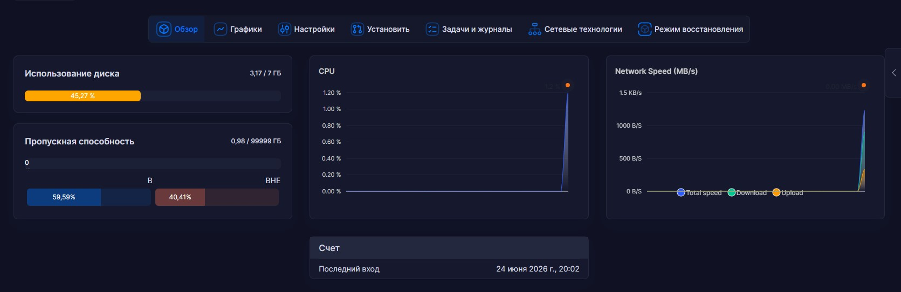

# Частная высокопроизводительная VPN-инфраструктура (VLESS + XTLS-Reality)

## 📌 Контекст и бизнес-задача проекта
Проект был разработан и развернут для **оптимизации образовательного процесса в школе программирования**. В ходе обучения дети активно используют международные ИТ-ресурсы, документацию, библиотеки и зарубежные сервисы, доступ к которым напрямую был нестабилен или ограничен. 

Чтобы обеспечить бесперебойную и безопасную работу учебных мест, была спроектирована и внедрена централизованная сеть, объединяющая 14+ рабочих станций учащихся в единый отказоустойчивый пул с высокой пропускной способностью.

## 🚀 Архитектурные и технические решения
* Ядро и протоколы: Использовано современное ядро Xray с протоколом VLESS и типом шифрования XTLS-Reality.
* Маскировка трафика (Anti-Censorship): Трафик полностью маскируется под стандартные TLS-сессии легитимных веб-сервисов (использована SNI-маскировка под домены Microsoft). Это делает сеть невидимой для систем глубокого анализа пакетов (DPI).
* Управление клиентами: Развернута веб-панель 3X-UI с разграничением прав доступа, изолированными конфигурационными ключами и возможностью динамического лимитирования.
* Оптимизация дискового пространства: Для предотвращения переполнения диска малого объема (7 ГБ) уровень логирования ядра Xray переведен в режим `Log Level -> none`. Это полностью исключило избыточные операции ввода-вывода (I/O) и логирование истории посещений пользователей, обеспечив 100% приватность (Zero-Log Policy).

---

## 📊 Метрики и ресурсы инфраструктуры

### Сетевая пропускная способность
* Выделенный лимит трафика на сервере: 100 ТБ (99 999 ГБ) в месяц, что обеспечивает фактический безлимит для текущего пула пользователей.
* Текущая нагрузка и архитектура рассчитаны на стабильную одновременную работу 14 активных десктопных клиентов без просадки CPU и задержек сети.

### Использование диска (Оптимальный баланс)
* Операционная система и база данных панели занимают фиксированные ~3.17 ГБ из 7 ГБ доступного пространства. Свободный остаток (~3.8 ГБ) зарезервирован под нужды системного рантайма благодаря отключенным фоновым логам.

### Административная панель (Интерфейс управления 3X-UI)

*(Здесь отображается live-статистика подключенных клиентов, порты и объем потребляемого трафика)*
### Список настроенных рабочих мест для учащихся (14+ клиентов)

*(На скриншоте видна панель управления со списком индивидуальных конфигураций для каждого учебного места, а также их статус подключения).*
---

## ⚙️ Используемый технологический стек

* OS: Ubuntu 24.04 LTS
* Core: Xray Core (VLESS, XTLS-Reality)
* Control Panel: 3X-UI (Управление входящими подключениями / Attached inbounds)
* Client Software: v2rayN (Windows) с маршрутизацией через виртуальные TUN-интерфейсы для обхода ограничений локальных брандмауэров ОС.

---

## 👩‍💻 Цель проекта и карьерные планы
Проект разработан и поддерживается самостоятельно с целью демонстрации практических навыков в сферах:
1. DevOps и Системное администрирование Linux (управление VPS, оптимизация ресурсов, работа с конфигурациями сервисов).
2. Компьютерные сети (понимание стека TCP/IP, маршрутизации, TLS-handshake, прокси-технологий).
3. Информационная безопасность (защита данных, маскировка трафика, шифрование).
